# Real-World Example: Image Classification Using CNN (Keras/TensorFlow)

## Project Overview
This project focuses on **classifying document images** (such as ID cards, application forms, cheque leafs) using **Convolutional Neural Networks (CNNs)** implemented with **Keras and TensorFlow**.  

The goal is to **automate document classification** for **faster processing in enterprise applications**, reducing **manual effort in sorting documents**.

### GitHub Repository:
[IBM/image-classification-using-cnn-and-keras](https://github.com/IBM/image-classification-using-cnn-and-keras)

---

## Problem Statement
Organizations handle **large volumes of scanned documents**—such as **identity proofs, application forms, and financial documents**—which require **automated classification** for streamlined processing.  
Manually sorting them is **inefficient and error-prone**.

---

## How This Project Solves the Problem
- A **Convolutional Neural Network (CNN)** is trained on **labeled document images**.
- The CNN **learns to recognize patterns** (e.g., **text structures, layouts, watermarks**) in each document category.
- When given an **unseen document**, the trained model can **predict its category with high accuracy**.
- The **automation enables organizations to process documents faster**, **reducing manual labor**.

---

## Problem-Solution Breakdown

| **Problem** | **How the Project Solves It** |
|------------|--------------------------------|
| Manually sorting large volumes of scanned documents is slow and error-prone. | Uses CNN-based image classification to automate document identification. |
| Extracting meaningful features from document images is complex. | CNN’s convolutional layers automatically learn patterns (e.g., text alignment, stamps, logos). |
| Traditional methods require handcrafted feature extraction. | Uses Transfer Learning with VGG16, eliminating the need for manual feature selection. |
| Training a deep learning model from scratch is resource-intensive. | Leverages a pre-trained VGG16 model, reducing training time and improving accuracy. |
| Deploying models for real-world use requires scalability. | Integrates with IBM Cloud Object Storage, making it scalable. |

---

## Understanding CNN (Convolutional Neural Networks)

CNNs are a class of **deep learning models** specifically designed for **image processing**. Unlike traditional machine learning models, CNNs can **automatically learn** to detect features such as **edges, textures, and objects** in images.

### A CNN consists of several types of layers:

### 1. Input Layer
- The **first layer** receives the input image.
- In this project, the **input images** are **224 × 224 pixels** with **3 color channels (RGB)**.
- The image is represented as a **tensor of shape (224, 224, 3).**

---

### 2. Convolutional Layers (Feature Extraction)
#### What It Does?
- Detects **edges, corners, textures, and patterns** in the image using **filters (kernels)**.
- Each filter **slides over the input image**, performing a **dot product operation**.
- Creates **feature maps** that highlight important structures.

#### **Mathematical Operation**
A convolution operation applies a **kernel (filter)** to the image:

\[
\text{Feature Map} = (\text{Input Image} * \text{Kernel}) + \text{Bias}
\]

#### **How It's Used in the Project?**
- The **first convolutional layer** extracts basic features like **edges and simple shapes**.
- The **second convolutional layer** captures **more complex patterns**.

---

### 3. Activation Function (ReLU)
#### What It Does?
- Introduces **non-linearity** into the model.
- Helps CNNs **learn complex relationships** beyond simple linear patterns.

#### **Mathematical Formula**
\[
f(x) = \max(0, x)
\]

- Prevents **negative values** from passing through the network.
- **Accelerates learning** compared to traditional activation functions like **Sigmoid**.

---

### 4. Pooling Layer (Dimensionality Reduction)
#### What It Does?
- Reduces the **size of feature maps** while retaining the **most important information**.
- Prevents **overfitting** by making the network less sensitive to small variations.

#### **Types of Pooling**
##### **Max Pooling (Most Common)**
- Selects the **maximum value** from a feature map region.
- Helps **extract dominant features** like edges.

##### **Average Pooling**
- Computes the **average value** in each region.
- Less common but **useful when preserving details** is important.

---

### 5. Flatten Layer
#### What It Does?
- Converts the **2D feature maps** into a **1D vector**.
- This prepares the data for the **fully connected layers**.
- Transforms extracted features into a format that can be **fed into a Dense layer**.

---

### 6. Fully Connected Layers (Dense Layers)
#### What It Does?
- Learns **relationships between extracted features**.
- Makes the **final classification**.
- The **first dense layer** processes extracted features.
- The **final layer outputs a probability score** for each class.

---

### 7. Output Layer (Softmax for Multi-Class Classification)
#### What It Does?
- Converts **raw scores into probabilities** for each document class.
- Ensures **probabilities sum up to 1**.

#### **Mathematical Formula**
\[
\text{Softmax}(x_i) = \frac{e^{x_i}}{\sum_{j} e^{x_j}}
\]

---

## **Keras**

### What is Keras?
Keras is an **open-source deep learning library** written in Python that provides an **easy-to-use interface** for building and training neural networks. It is designed to be **user-friendly, modular, and extensible**, making it an ideal choice for both beginners and professionals.

### **Key Features of Keras**
- **High-Level API** – Simplifies deep learning by providing pre-built functions for layers, optimizers, and loss functions.
- **Runs on Top of TensorFlow** – Uses TensorFlow as a backend for computations.
- **Modular and Flexible** – Easy to build complex neural network architectures.
- **Supports CPUs & GPUs** – Can run on **regular CPUs** or use **powerful GPUs** for faster training.
- **Pretrained Models** – Offers models like **VGG16, ResNet, and MobileNet** for transfer learning.
- **Production-Ready** – Can be integrated into **mobile apps, web services, and embedded systems**.

### **Ways to Create Models in Keras**
Keras provides a simple, high-level interface for building deep learning models. It offers **three primary ways** to create models:

1. **Sequential API** – Best for **simple models** (one layer after another).
2. **Functional API** – Allows **more complex architectures** (multiple inputs/outputs).
3. **Model Subclassing** – Full control over layer customization.

---

### **1. Sequential API (Best for Beginners)**
- The **Sequential model** is the easiest way to build a deep learning model in Keras.
- It **stacks layers in order**, from **input to output**.
- Each layer is added **sequentially**, making it easy to understand.

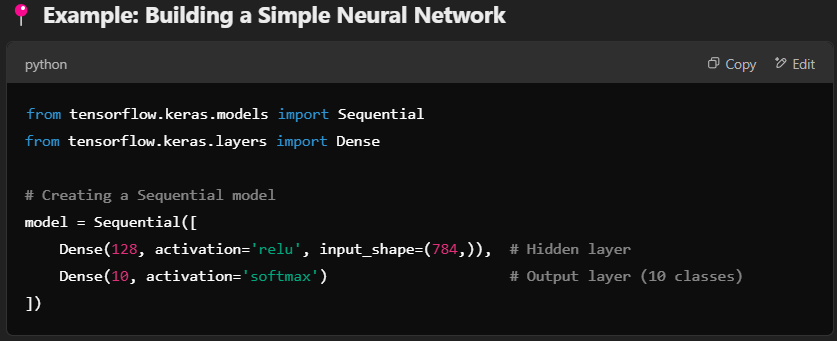

---

### 2. Functional API (For Complex Models)
When models need **multiple inputs, multiple outputs, or shared layers**, the **Functional API** is the best choice.  
This approach allows **more flexibility** in designing **advanced architectures**.

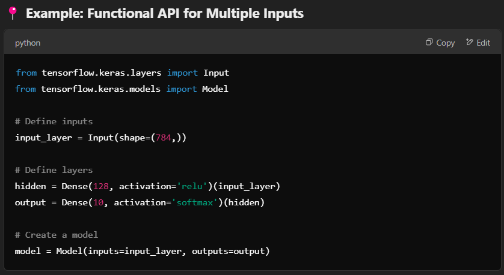

---

### 3. Model Subclassing (For Advanced Custom Models)
For **full control** over layer behavior, you can **subclass the `Model` class** and define **custom layers**.  
This is useful for **researchers developing new deep learning architectures**.

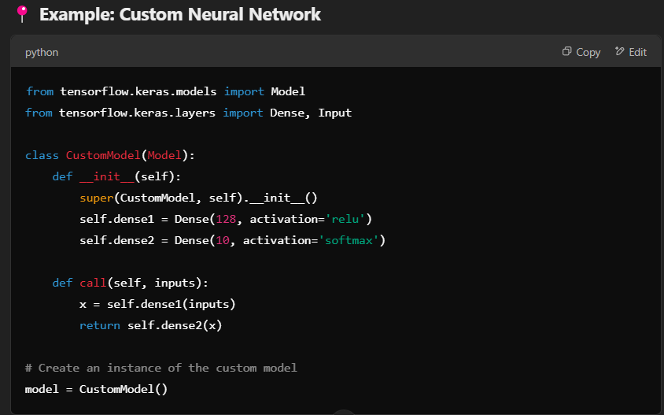

---

## Layers in Keras

| **LAYER TYPE**                 | **PURPOSE**                                         | **EXAMPLE**                              |
|--------------------------------|-----------------------------------------------------|------------------------------------------|
| **Dense (Fully Connected Layer)** | Connects every neuron in one layer to every neuron in the next layer. | `Dense(128, activation='relu')` |
| **Conv2D (Convolutional Layer)**  | Extracts spatial features from images. | `Conv2D(32, (3,3), activation='relu')` |
| **MaxPooling2D (Pooling Layer)**  | Reduces spatial size of feature maps. | `MaxPooling2D(pool_size=(2,2))` |
| **Flatten**                     | Converts 2D feature maps into 1D vectors. | `Flatten()` |
| **Dropout**                      | Prevents overfitting by randomly dropping neurons. | `Dropout(0.5)` |

---

## Training a Model in Keras

### 1. Compiling the Model
- **Adam Optimizer** – Adjusts weights using gradient descent.
- **Categorical Crossentropy** – Measures classification loss.
- **Accuracy Metric** – Monitors model performance.

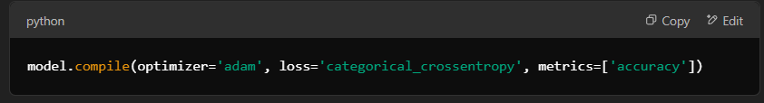
---
### 2. Training the Model
- **Epochs** – Number of times the model sees the dataset.
- **Validation Data** – Helps check how well the model generalizes.

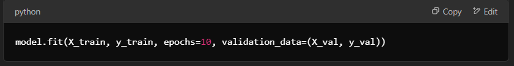

---

### 3. Evaluating the Model
- This checks how well the model performs on **unseen data**.

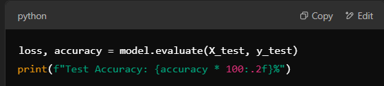

---

## Model Used in This Project: VGG16

This project uses **VGG16**, a **pre-trained CNN model** developed by **Oxford’s Visual Geometry Group (VGG)**.  
VGG16 was trained on the **ImageNet dataset (1.4 million images, 1000 categories).**

### **Why Use VGG16?**
✔ **Proven architecture** with high accuracy.  
✔ **Pre-trained on millions of images** → Saves training time.  
✔ **Extracts deep-level features** → Works well for document classification.  

---

## What is Transfer Learning?

**Transfer Learning** is a technique where a **pre-trained model** (e.g., **VGG16**) is adapted for a **new task**.  
Instead of training from scratch, the model **reuses existing learned features**.

### **How Transfer Learning Works**
1. **Use a pre-trained model** (like VGG16).
2. **Remove the original classification layer** (since it was trained for different classes).
3. **Freeze the lower layers** (so the model retains learned patterns).
4. **Add new layers** for the specific classification task.
5. **Train only the new layers** on the new dataset.

**This method significantly speeds up training and improves accuracy!**  

---

## How CNN, Keras, VGG16, and Transfer Learning Work Together in This Project

In this project, **CNN, Keras, VGG16, and Transfer Learning** work together to create an **automated document classification system**.  
Instead of **building a CNN from scratch**, we **reuse a pre-trained model (VGG16)** and customize it to classify **document images**.

---

## Step-by-Step Explanation of How Everything Works Together

### **1. Image Input & Preprocessing (Handled by Keras & CNN Layers)**  
#### **What Happens?**
- The model **receives a document image** (e.g., **ID Card, Invoice, Cheque**).
- It **resizes the image to 224×224 pixels** (because **VGG16 expects this size**).
- The image is **normalized** (pixel values scaled between **0-1**).

---

### How Keras is Used Here?
Keras **automates** loading, resizing, and normalizing images.

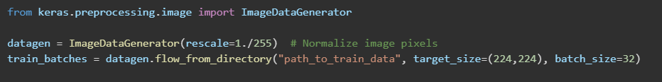

---

## 2. Feature Extraction Using Pre-trained VGG16 (Handled by CNN & VGG16)

### **What Happens?**
- Instead of training a new CNN, we **use the convolutional layers of VGG16**.
- **VGG16 automatically extracts features** (e.g., **text alignment, stamps, logos**) from document images.

### **How Keras & VGG16 Work Together?**
- `weights="imagenet"` → Uses **pre-trained weights** from **ImageNet**.
- `include_top=False` → **Removes the original classification layer** (since we are classifying documents, not ImageNet categories).
- **VGG16 now acts as a feature extractor**, handling low-level details.

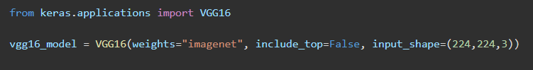

---

## 3. Freezing Pre-trained Layers (Handled by Transfer Learning)

### **What Happens?**
- We **freeze all convolutional layers of VGG16** to retain learned features.
- This prevents losing **valuable knowledge** from ImageNet training.

### **How Transfer Learning Works in Keras?**
- **Transfer Learning** keeps the valuable knowledge from **VGG16 intact**.

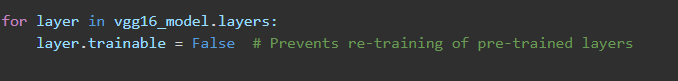

---

## 4. Adding Custom Classification Layers (Handled by Keras)

### **What Happens?**
- The **last layer of VGG16** is replaced with a **new fully connected layer**.
- We **train only these new layers** to classify documents.

### **How Keras Builds the New Layers?**
- Now, our model can **classify document images** while using **VGG16’s learned knowledge**.

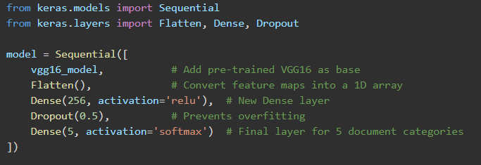

---

## 5. Training Only the New Layers (Handled by Transfer Learning & Keras)

### **What Happens?**
- The **new classification layers are trained**, while **VGG16 remains frozen**.
- The model **learns to recognize document types** based on extracted features.

### **How Keras Trains Only the New Layers?**
- **VGG16’s lower layers remain frozen**, and **only new layers** learn document-specific patterns.

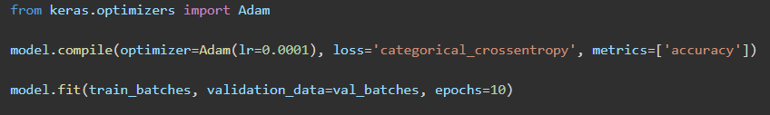

---

## How Everything Works Together

| **TECHNOLOGY**     | **ROLE IN THE PROJECT**               | **HOW IT HELPS**                                           |
|--------------------|--------------------------------------|-----------------------------------------------------------|
| **CNN**           | Extracts features from images       | Learns important visual patterns in documents            |
| **KERAS**         | Simplifies model building and training | Allows easy integration of pre-trained models            |
| **VGG16**         | Acts as a feature extractor         | Uses knowledge from millions of images to recognize documents |
| **Transfer Learning** | Adapts VGG16 to new document categories | Avoids retraining CNN, saving time and resources        |

---

## Role of IBM

IBM is primarily used for **cloud-based storage and model deployment** in this project.  
Instead of handling images and model data **locally**, IBM services help **manage, process, and deploy** the model efficiently.

---

### **IBM Cloud Object Storage (COS) – Managing Large Datasets**
#### **🔹 Why is it used?**
- Instead of storing document images **locally**, IBM Cloud Object Storage **securely stores them online**.
- This enables **scalability**, meaning more images can be added **without worrying about storage limitations**.

---

### **IBM Watson Studio – Cloud-Based Training**
#### **🔹 Why is it used?**
- Instead of **training the CNN locally**, IBM Watson Studio provides a **cloud-based Jupyter Notebook**.
- This enables users to **train models remotely** without requiring **high-end hardware**.

#### **🔹 How is it implemented?**
- **Upload the dataset** to IBM Watson Studio Storage.
- **Run Jupyter Notebook** in Watson Studio **without needing a local setup**.
- **Makes training CNNs easy and scalable** without expensive hardware.

---

### **IBM Watson Machine Learning (WML) – Model Deployment**
#### **🔹 Why is it used?**
- Instead of keeping the trained model on **local devices**, IBM WML **deploys it as a cloud-based API**.
- This allows **real-time classification** of documents **from any location**.
- Enables the model to be used in **real-time applications**, like **web or mobile apps**.

---

### **IBM Cloud Pak for Data – AI Model Management**
#### **🔹 Why is it used?**
- Helps **monitor the performance** of the deployed model.
- Allows **scaling the AI service** when handling **large volumes** of document classification.
- Ensures the **AI system is well-managed, secure, and scalable**.

---

## How IBM Services Work Together in This Project

- **IBM Cloud Object Storage (COS)** → Stores **large document datasets** for CNN training.
- **IBM Watson Studio** → Provides a **cloud-based Jupyter Notebook** to train the model.
- **IBM Watson Machine Learning (WML)** → Deploys the trained model as a **REST API**.
- **IBM Cloud Pak for Data** → Manages the **AI system for real-world applications**.

By using **IBM**, this project becomes **cloud-based, scalable, and accessible from anywhere!**

---

## What This Project Achieves

This project successfully implements **document image classification** using **deep learning**.  
By leveraging **CNNs, Keras, VGG16, and Transfer Learning**, we build a **fast, accurate, and efficient model** that can **automatically classify document images** into different categories (**e.g., ID cards, cheques, invoices, etc.**).

### **Instead of training a model from scratch, we:**
✔ **Use a pre-trained VGG16 model** to extract features.  
✔ **Freeze the earlier layers** to retain pre-learned knowledge.  
✔ **Add a new classifier on top** to recognize document categories.  
✔ **Train only the final layers**, making the model **faster and more efficient**.  
✔ **Achieve high accuracy** with **minimal training data and computation**.  

This approach **saves time, improves performance, and simplifies model training**, making it **ideal for real-world applications**.

---

## Key Takeaways
- **CNNs automatically learn patterns** from images, eliminating **manual feature engineering**.
- **Keras makes building and training** deep learning models **easy and accessible**.
- **VGG16 acts as a powerful feature extractor**, reducing the need for **large datasets**.
- **Transfer Learning allows us to reuse knowledge** from pre-trained models, making training **faster and more effective**.
- **This project demonstrates the power of deep learning** in automating **document classification**—a process that can be applied to **banking, legal, healthcare, and enterprise document processing**.

[Back to Image Processing](../) | [Back to Repository Overview](../../README.md)